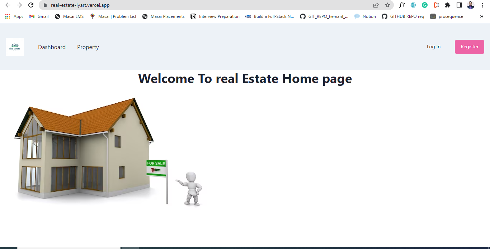
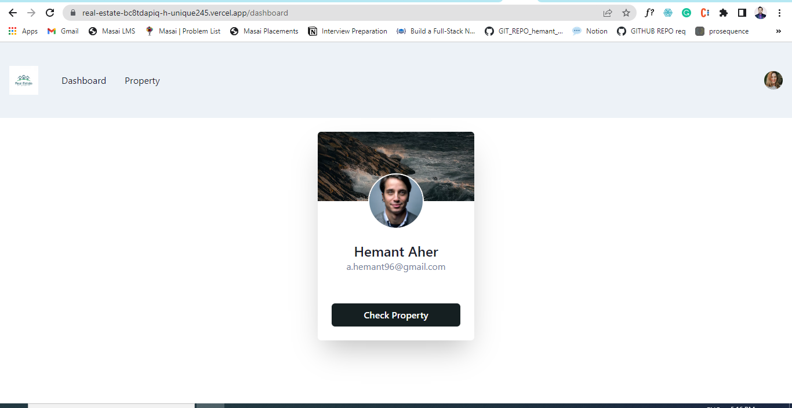
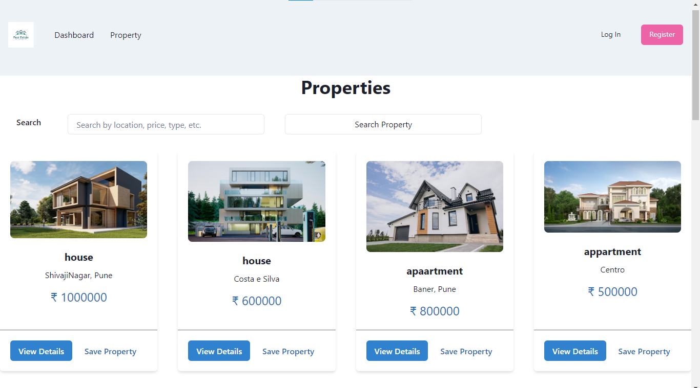
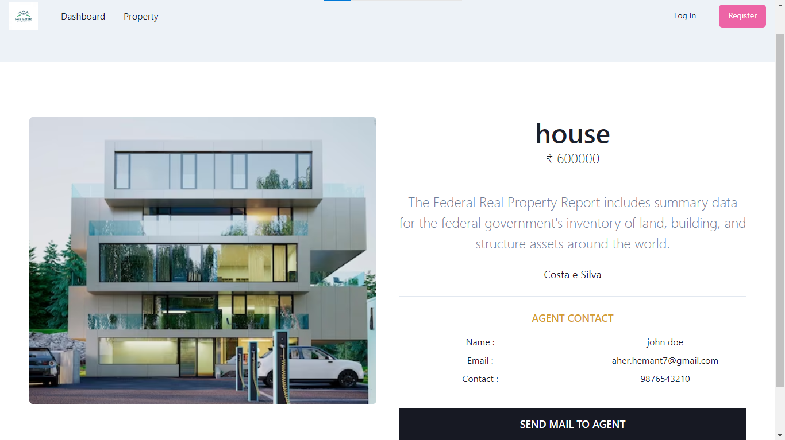

To start this app 
1. Clone the repository
2. ``` cd real-estate ```
3. ``` npm install  ```
4. ``` npm  start ```

You can alos visit on real-estate-lyart.vercel.app.

here are some glimplse of this project 

## Homepage 



## Dashboard 



## Property 



## Property-Details 




### Thank You for visiting my repository